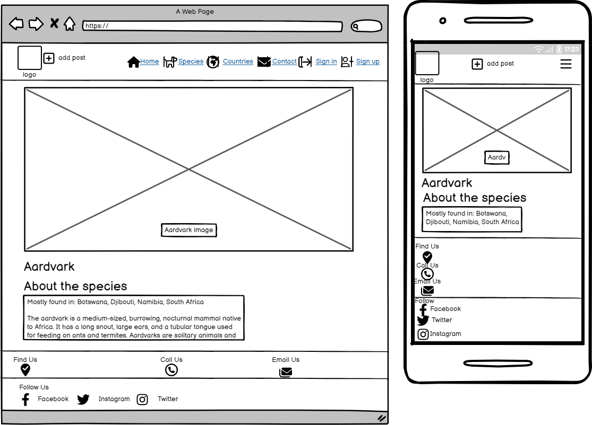

# Friends WildLife

* This is a platform for local nature reserves, where lovers of Africa Wildlife meet to air their views and opinoins about the wildlife conservation, and also to know more about African wild animals and countries where it can be found. User can also contribute in their own way by sharing photos and comment about their experince in the wild life of Africa.
  

💻 [Website](https://friendsa.herokuapp.com)

This site was created for Portfolio Project nr 5. 
Diploma in Full Stack Software Development, at the [Code Institute](https://codeinstitute.net/)


## Table of Contents

- [Friends WildLife](<#friends-wildlife>)
    * [The Strategy Plane](<#the-strategy-plane>)
    * [Agile Planning](<#agile-planning>) 
   
- [Epics](<#epics>)
     * [User Stories](<#user-stories>)   
  
- [Testing User Stories](<#manual-testing>)
- [Logo](<#logo>)
- [DropDown Menu Burgar](#dropdown-menu-burgar)

- [Users](<#users>) 
    * [Logged in Users](<#logged-in-users>)
    * [Logged out Users](<#logged-out-users>)
      
- [Feactures](<#features>)
    * [Home Page](<#home>) 
    * [Species Page](<#species>)
    * [Countries Page](<#countries>)
    * [Contact Page](<#contact>)
    * [Feed Page](<#feed>)
    * [Account](<#account>)
    * [Sign In](<#sign-in>)
    * [Sign Up](<#sign-up>)
    * [Sign Out](<#sign-out>)
    * [Get Started](<#get-started>)


- [Validation](<#validation>)
     * [Code Validation](<#code-validation>)
     * [Eslint](<#eslint>)
     * [Chrome Dev Tools Lighthouse](<#chrome-dev-tools-lighthouse>)

- [Reusable React Components](<#reusable-react-components>)

- [Technical Design](<#technical-design>)      
    * [Agile Planning](<#agile-planning>)
    * [Colour-Scheme](<#colour-scheme>)
    * [Typography](<#typography>)
    * [Imagery](<#imagery>)
    * [Wireframes](<#wireframes>)
 
- [Bugs](<#bugs>)
- [Security Features](<#security>)
- [Basic Technologies](<#basic-technologies>)
- [Frameworks and Tools](<#frameworks-and-tools>)
- [Packages](<#packages>) 
- [Deployment](<#deployment>) 
   * [Heroku](<#heroku>)
   * [React Frontend to the API-Backend](<#api-backend>)
   * [Forking the GitHub Repository](<#forking>)
- [Locally](<#locally>)
- [Credits](<#credits>) 
- [Acknowledgements](<#acknowledgements>)


## The Strategy Plane

### Site Goal

* Friends WildLife is aimed to lovers of the wildlife. The site encourages user to share their thoughts, know more about animals and the countries where they are found. 
* Friends WildLife is aimed in capturing and sharing the beauty and importance of African wildlife through photography and by showcasing the natural wonders of Africa. 
* Friends WildLife can raise awareness and inspire others to care for its wildlife.

### Users Goal

* User can also contribute in their own way by sharing photos of African wildlife and comment about their experince in the wild life in any of the African country
* User can raise awareness and inspire others about their experience in the wildlife 

### Agile Planning

* This project was developed using agile methodologies by delivering small features in incrementally with a three phase loop.

* Stories were assigned to epics, prioritized under the Todo, In progress, and Done. They were assigned to track and monitor the progress of the project and stories 
  allocated accordingly to the complexity. "Todo" stories is where I have listed the 'to do' stories lines, and "In progress" is where I have on-going work work in the 
  tast mangement listed, likewise 'Done list', where I have the task completed.

* The Kanban board was created using github projects and can be located [here](https://github.com/users/email2ify/projects/12) and can be viewed to see more information on 
  the project cards. All stories except the documentation tasks have a full set of acceptance criteria in order to define the functionality that marks that story as 
  complete.


<hr>


### Epics:

**Set Up**

* This Epic covers all the initial setup of the React application and dependencies.

**Posts**

* It covers the frontend creation of the application in regards to posts. This is to allow users to interact with the backend API via the user interface in order to create, read, update and delete their own posts.

**Comments**

* It gives the user the ability to comment on the frontend of the application in regards to comments on posts. This is to allow users to interact with the backend API in order add comments on posts.

**Profiles**

* It covers the frontend application in showing the posts on profiles. This is to allow users owner to manage their own profiles posts.

**Add Post**

* There is where users can add images on the frontend application in regards to add post. This is to allow users to interact with the backend API, to display and delete images

**Species**

* This aspect of front end application for animal species, it allows users to see variety of animal, names and their story. This is to educate users and to know more about the animal, using the backend API.

**Countries**

* In this aspect, the front end application for countries, enable users to be able to choose a desired country to know the types of animal or species that are found in that particular country. This is to allow users to know more about the species in that country, 
  using the backend API.

**Contact form**

* This is also an application in the frontend, where users can send in their queries or enquiries, with the help of the backend API.

**Feeds**

* This aspect is the front end application in regards to feed. This is to allow users to read comment, view images and like a post,interacting with the backend API.

##### Back to [top](#table-of-contents)

## User Stories:

**Posts**

* As a logged in user I can add images and create posts so that I can share my images
* As a user I can keep scrolling down the images on the feed, and expected to load automatically so that I don't have to click on 'next'.
* As a post owner I can edit my post title and description so that I can make corrections or update my post after it was created
* As a logged in user I can view the posts I liked inorder to have a memory of it
* As a logged in user, I can like a post so that I can show my like
* As a user, I can search for posts with keywords, so that I can find the posts I am most interested in.
* Users can not view "/feed" route when not logged in

**Comments**

* As a user I can read comments on posts so that I can read what other users think about the posts
* As a logged in user I can add comments to a post so that I can share my thoughts about the post
* As an owner of a comment I can manage my comment, edit or delete it all

**Species**

* As a user, I would like to be able to see all animal species in order to choose what animal to be curious to know more about.
  
**Country**

* As a user, I would like to check a particular african country to know what types of animal that can be found there.

**ContactForm**

* As a user, I would like to be able to send in enquiries, complaint or any post issues.

**Footer**

* As a user, I would like to be able to follow  the site organization on every social media platform in order to show my solidarity.


**User Story in General:**

* As a logged out user I can view sign in and sign up options so that I can either sign in or sign up
* As a Site User I can view a list of posts and also add posts so that I can select which animal post that interest me to read about,comment and to add my own post
* As a Site User I can click on a post so that I can view the image
* As a Site User I can view comments on a post image so that I can read the written compliments or story
* As a Site User I can view the number of likes on each post so that I can see which is the most popular with likes
* As a Site User I can register an account so that I can post, comment and like
* As a Site User/Owner I can create, read, update and delete posts so that I can manage my post content
* As a Site User, I can navigate to the search blank space so that I can easily search for wild life images.
* As a user I can view the details of a single post so that I can learn or read more about it
* As a user I can view "/feed" route when logged in only
* As a user I can search for wild life specie or animal without the need to create an account
* As a user I can search for wild life alphabetically on species page without the need of going back to the home page
  

## Logo

* The site logo is displayed on the left side of the navigation bar at all times
  
  


## DropDown Menu Burgar

* As a user , I can navigate from any device, like a mobile device and the user will still have a good user experience with the burgar menu option displayed on the device 


<br>

## Users: 


**Hovering the Navbar**

The Users effect of hovering the Navbar is Color BLUE, giving a clear indication of which Narbar page the mouse is hovering and when the user click on the navigation page.


* Countries
<br>

## Logged in users


When a user is logged in the following navigation items are shown:

* logo
* Add Post
* Home
* Feed
* Sign Out
* Users Icon

## Logged out users


 
When a user is logged out the following navigation items are shown:
* logo
* Home
* Sign In
* Sign Up

<br>

# Features:

## Manual Testing

### Testing User Stories - Responsiveness

Responsiveness is a feature which can be seen through the Freinds wildlife. It gives users the ability to view the site on various display sizes while still having an enjoyable user experience.
* As the site owner, I would want the site to be fully responsive so that users can use it across multiple devices and create a good user experience.

| Feature       | Action        | Expected Result  | Actual Result |
| ------------- | ------------- | -------------    | ------------- |
|  Responsiveness  | Use the site on a range of devices and screen sizes  | Users will have a pleasant and enjoyable experience on the website regardless of their screen or device size  | Works as expected |


<hr>
<br>

## Navigation
### Testing User Stories - Navigation Bar

* As a user, I can use the navigation bar so that I can access other pages within the app.

| Feature       | Action        | Expected Result  | Actual Result |
| ------------- | ------------- | -------------    | ------------- |
|  Nav Bar  | Nav bar located at the top of each page and select the relevant icon link, and on a smaller devices click on the burger dropdown button to access the same icons links  | User can hover on the nav bar located at the top of each page to navigate all pages of the app  | Works as expected |


<hr>
<br>

## Home 
## Testing User Stories - Home Page

* As a user I can view and read what the website is all about and a carousel of images of the wildlife species
* As a user, I can view the Home Page so that I can understand what the website is about, create an account or log in. 

| Feature       | Action        | Expected Result  | Actual Result |
| ------------- | ------------- | -------------    | ------------- |
|  Home page  | Navigate to the Friends WildLife site in your internet browser. View the landing page.  | User to view the landing page and be able to understand what the website is about  | Works as expected |


<hr>
<br>

## Species
### Testing User Stories - Species Page

* As a user I can view and scroll down to any species image of your choice and click on the animal to get more details about the animal and countries most often found
* As a user I can search for wild life of my choice, so that I can know more about the animal and the countries they are likely to be found in.

| Feature       | Action        | Expected Result  | Actual Result |
| ------------- | ------------- | -------------    | ------------- |
|  Species  | Navigate to the species page. show Animals that can be found from in a country. Click on a country to view About the specie.  | Users to be able to get the species details in a particular country| Works as expected |
|  Search Species | Log in and navigate to the Species page from the home page without a log in. Search for favorite animal alphabetically.  | Users to be able to view search wildelife content from the database  | Works as expected |

<br>

**Search wildlife**


 **About Species**


<hr>
<br>

## Countries
### Testing User Stories - Countries Page

* As a user I can directly choose from listed countries on the page to know what animals are found there

| Feature       | Action        | Expected Result  | Actual Result |
| ------------- | ------------- | -------------    | ------------- |
|  Countries  | Navigate to the countries list page by clicking on Countries icon in the nav bar. Scroll the countries list.  | Users to be able to scroll through all african country's list | Works as expected |
  


<hr>
<br>

## Country
### Testing User Stories - Country

* As a user I can view the content of a chosen country from the countries list on the page, so I can know what what animal or species that are likely to be found in that specific African country

| Feature       | Action        | Expected Result  | Actual Result |
| ------------- | ------------- | -------------    | ------------- |
|  Country  | Navigate to the countries page showing List of countries with animals by clicking on Countries icon in the nav bar. Scroll the countries list and click on a contry to view Animals that can be found there.  | Users to be able to scroll through all african country's list and Animals that can be found in that particular country | Works as expected |
  
<hr>
<br>


<hr>
<br>

## Contact
### Testing User Stories - Contact Page

* As a user I can contact the organization and submit my reason of complaint as regards 'general enquiery','login issues','report a post' or 'delete account'.
* As a user, I can receive site feedback on enquiries so that I can confirm whether the contact form submission was successful or not.
* As a user, I can contact form enquiries so that I can submit my query

| Feature       | Action        | Expected Result  | Actual Result |
| ------------- | ------------- | -------------    | ------------- |
|  Report a post | Perform an operation of reason of complaint | User to be reach out regarding reason of complaint | Works as expected |
| Contact | Click on the Contact icon from the nav bar which is available to annonymous and authenticated users. Enter the relevant information to the form fields and click on submit| Users and non-users to the site to have the access to the site for any query |  Works as expected|


<hr>
<br>

## Feed 
### Testing User Stories - Feed Page

* As a user I can view all the most recent posts, ordered by most recently created first so that I am up to date with the newest content
* As a user, I can scroll through all animal post on the app so that I can find my post that interest me to comment or like.

| Feature       | Action        | Expected Result  | Actual Result |
| ------------- | ------------- | -------------    | ------------- |
|  Feed Page  | Log in and navigate to the Feed page by clicking on the feed icon in the nav bar. Scroll the animal list of images .  | Users to be able to scroll through all feed posted by other users | Works as expected |


<hr>
<br>

## Account
### Testing User Stories - User Account

* As a new user, I can register an account so that I can have access to feeds and like post 

| Feature       | Action        | Expected Result  | Actual Result |
| ------------- | ------------- | -------------    | ------------- |
|  Authentication  | Navigate to the sign up page, fill in the required fields and submit the sign up form  |User authentication will be created successful when correct  | Works as expected |
|  Sign Up  |  Navigate to the sign up page, fill in the required fields and submit the sign up form | Enter the required fields for sign up,and the user will be redirected to the log in page | Works as expected |
|  Input Validation  | Enter values into the sign up form fields  | Input fields requires validation otherwise it will  for errors  | Works as expected |


<hr>
<br>

## Sign In
### Testing User Stories - Sign In

* As a user I can sign in to follow up with recent posts on the feed and activities on the platform
* As a user, I can log in so that I can access my account, view my post, most like and own profile posts. 

| Feature       | Action        | Expected Result  | Actual Result |
| ------------- | ------------- | -------------    | ------------- |
|  Authentication  | Navigate to the log in page, fill in the required fields and submit form to login  | User log in credentials to be authenticated with the database and granted access if valid  | Works as expected |
|  Log in  | Navigate to the log in page, fill in the required fields and submit form to login  | User log in credentials to be authenticated with the database and granted access if valid  | Works as expected  |
|  Input validation  | From the log in page enter information to the username and password fields  |  User to be informed if entered values to not meet validation criteria | Works as expected | 


<hr>
<br>

## Sign Up
### Testing User Stories - Sign Up

* As a user I can register an account with the organization in order to comment, post and follow up with recent posts on the feed and activities on the platform

| Feature       | Action        | Expected Result  | Actual Result |
| ------------- | ------------- | -------------    | ------------- |
| Input validation   | Navigate the site. Click on the log in icon in the nav bar. Enter username and password to the relevant fields.   | User input to be validated again and signed in if invalid password it will be presented with error messages | Works as expected |
|  Sign Up | Navigate to the Sign up page, fill in the required fields and submit the login form  | User sign up credentials to be authenticated with a unique username and password for it to be stored in the database  | Works as expected  |


<hr>
<br>

## Sign Out
### Testing User Stories - Sign Out

* As a user I can sign out from my account when done with all recent posts on the feed on the platform
* As a user, I can sign out so that other users using the same device cannot access my account. 
* As a user, I can sign out with an indicating message when logged out so that I can be sure that I have logged out of my account properly.

| Feature       | Action        | Expected Result  | Actual Result |
| ------------- | ------------- | -------------    | ------------- |
|  Log out  | From the nav bar click on the log out icon  | User to be successfully logged out with a message "GoodBye!Thank you for visiting.See you soon!" and return to the home page  | Works as expected |


<hr>
<br>

## Get Started

**None Users**

* Restricted access has been implemented on the Feed posts for users who are not signed in, they will not be able to create a post, like or comment on post

<br>

### Testing User Stories - Users

* As a user I can easily get started just by clicking on the Get Started button and it will redirect the user to a SignIn
* As a new user, I can register an account so that I can have access to feeds and like post 

| Feature       | Action        | Expected Result  | Actual Result |
| ------------- | ------------- | -------------    | ------------- |
|  Authentication  | Navigate to the Get Started button, and click on it |User will be ask to sign In to commence   | Works as expected |
|  Sign In  |  Navigate to the sign up page, fill in the required fields and submit the sign up form | Enter the required fields for sign up,and the user will be redirected to the log in page | Works as expected |
|  Input Validation  | Enter values into the sign up form fields  | Input fields requires validation otherwise it will  for errors  | Works as expected |


<hr>
<br>

### Testing User Stories - Feed
* As a logged in user I can like a post so that I can see my likes and comments that interest me
* Logged in users have full access to post, comment, like or unlike. This will help ensure that unregistered users are not allow on the website
* As a user I can view all the most recent posts by other users, orderly, and by most recently posted so that I am up to date with the newest content
* As a user, I can scroll through all wild life animals post on the application so that I can find a post that interest me to comment or like.

| Feature       | Action        | Expected Result  | Actual Result |
| ------------- | ------------- | -------------    | ------------- |
|  Feed   | Log in and navigate to the Feed page, click on any wild life post.| Users to be able to scroll through all wild life feed posted by other users | Works as expected |


<hr>
<br>

### Testing User Stories - Edit or Delete comment on a post

* As a post owner, I can edit or delete my comment on a post, so that I can make corrections or update the post, moreover, Only the user who created the post will be able to edit comments or delete post. This will ensure that users have full control of their own posts and unauthorized users are unaccepted.

| Feature       | Action        | Expected Result  | Actual Result |
| ------------- | ------------- | -------------    | ------------- |
|  Edit post comment  | Navigate to a post. Click on a post to view the post. Scroll to bottom and the comment section. Find the comment you wish to edit and click on the three dots icon. Enter updated comment and click save  | User to be able to edit and update their owned comments  | Works as expected |
|  Delete post comment  |  Navigate to a post . Scroll to bottom and the comment section of the post displayed(wildlife images) . Find the comment you wish to delete and click on the three dots icon. Click on the delete button to delete the comment | User to be able to edit and update their owned comments  | Works as expected |


<hr>
<br>


### Testing User Stories - Add Post

* Users can add Post just by clicking on the "add icon" to the left of the nav bar in order for logged in users to create a post when they want to share memory pictures.
* As a user, I can manage my post so that I can add, edit or delete post. 

| Feature       | Action        | Expected Result  | Actual Result |
| ------------- | ------------- | -------------    | ------------- |
|  Create a post  | Click on the Create add button which is located at the top left page, click or tap to upload an image and fill in the form and then click on create save.  | User to be able to successfully create a post which will be added to the database and content  | Works as expected |
|  Delete Post  | Navigate to the post detail page by clicking on the relevant post on the feed. Click on the 3 dots icon in the top right corner of the post. Click on the delete button  | User to click the delete button and the post to be deleted from the database  | Works as expected |
|  Edit post  | Navigate to the feed, post content, click on the 3 dots icon located in top right corner and click on the edit button to be taken to the edit post.change the content and click on save or cancel to cancel the current edit  | User to click the edit button and the post edit content to be displayed in which the user can update the post content  | Works as expected |


<hr>
<br>

### Testing User Stories - Comments

* Below each post, there will be a comment box available to logged in users. This will allow users to add comments under posts.

* A comment count will also be shown under the post, to allow users to see how many people have commented on each post.

* A comment or updated time will be displayed in either minutes ago or days ago 

* The username and Avatar of the user that created the comment will displayed on each comment

* As a user, I can edit or delete my comment on a post. 

| Feature       | Action        | Expected Result  | Actual Result |
| ------------- | ------------- | -------------    | ------------- |
|  Edit post comment  | Navigate to a users profile post list. Click on post to view the post detail page. Scroll to bottom and the comment section for that particular post that is displayed.Find the comment you wish to edit and click on the three dots icon. Enter updated comment and click save  | User to be able to edit and update their owned comments  | Works as expected |
|  Delete post comment  |  Navigate to a users profile post list. Click on a post to view the post detail page. Scroll to bottom and the comment section for that particular post that is displayed . Find the comment you wish to delete and click on the three dots icon. Click on the delete button to delete the comment | User to be able to edit and update their owned comments  | Works as expected |


<hr>
<br>


### Testing User Stories - Search Bar

 Search Bar is a feature giving users the ability to search for a users post by users name or based on key word input.
* As a user, I can search for post via feed list so that I can find specific post about animal.

| Feature       | Action        | Expected Result  | Actual Result |
| ------------- | ------------- | -------------    | ------------- |
| Feed list   | When logged in, navigate to the feed lists page from the nav bar. Scroll down the page to view all posts that are on the feed  | User can see all post with list of all animal that are posted in the feed users  | Works as expected |
| Post search   | When logged in, navigate to the feed page from the nav bar. Use the search bar at the top of the page to search for post based on words or alphabet  | User to be able to comments,like or unlike  | Works as expected |
 


<hr>
<br>

### Testing User Stories - Search WildLife

* As a user I can search for wild life specie or animal without the need to create an account(very friendly in this features here)

| Feature       | Action        | Expected Result  | Actual Result |
| ------------- | ------------- | -------------    | ------------- |
|  Search  | Log in and navigate to the search blank from the home page without a log in. Search for favorite animal.  | Users to be able to see all seacrch species from the database  | Works as expected |


<hr>
<br>

### Testing User Stories - PageNotFound

 Specific component, used to display a 404 page made up of an image file and return home button for when the page does not exist.
* As the site owner, I would want a 404 error page so that users do not have to use the back navigation button if an error occurs.

| Feature       | Action        | Expected Result  | Actual Result |
| ------------- | ------------- | -------------    | ------------- |
|  Error pages  | Navigate to any page that does not exist  | User to be presented with 404 error page and a button to return home  | Works as expected |


<hr>
<br>


### Testing User Stories - Profile

* As a user I can view own profiles post , so as to have records of posts, comment and likes

| Feature       | Action        | Expected Result  | Actual Result |
| ------------- | ------------- | -------------    | ------------- |
|  profile   | Navigate to the users profile by clicking on the profile icon on the nav bar to the right. Click profile icon. | The User only have own profiles posts display | Works as expected |


<hr>
<br>

**Footer**

* Footer image from the landing page


##### Back to [top](#table-of-contents)

<hr>
<br>

## Validation

## Code Validation 


The site url has was passed through the [W3C html Validator](https://validator.w3.org/), the [W3C CSS Validator](https://jigsaw.w3.org/css-validator/) and the [ESLint Validator](https://eslint.org/docs/latest/use/getting-started#next-steps).

**W3C Validation Results**

* No errors found using the URL passed through the W3C HTML validation checker. 


<br>


<br>

## Eslint

Eslint was installed and configured locally. No problems were detected in the Problems tab and the terminal when going through the JS files


## Chrome Dev Tools Lighthouse


The application has been tested with Chrome Dev Tools Lighthouse Testing which tests the application for:

* Performance
* Accessibility
* Best Practices
* SEO
One or two of the pages performanced a slightly low score because of the amount of images. This could be improved by resizing and reducing the mbs of the picture to even a smaller size and compressing before uploading.

<br>

## Home


<br>

## Species


<br>

## Countries

This was tested with incognito mode because the page loaded too slowly to finish within the time limit on a normal chrome extensions.


<br>

## Contact


<br>

## Signin


<br>

## Signup


<br>

## Login-user


##### Back to [top](<#table-of-contents>)


## Reusable React Components

**The Navbar in Reusable React Components** 

On the NavBar of my webpage, I have re-usable components on Home,Species,Contact form,Feed,Sign Out and SignIn model, inorder to improve the user experience.
They are all Reusable React Components on the Navbar to provide a consistent user experience, efficient navigation, and code maintainability. It also contributes to a more cohesive and user-friendly application design.

* Navigation for example: The Navbar often contains navigation links that allow users to move between different sections or pages within the application. By placing it on all components, users have easy access to navigate anywhere in the webpage without having to go back to the homepage or use other navigation methods.

* Responsive Design for example: When designing a responsive web application, the Navbar is usually adapted to different screen sizes and devices. Reusing the same Navbar ensures that it scales appropriately and maintains a consistent user experience across various devices.

* Reusable Code: In this aspect,using a reusable Navbar component helps in maintainability. Instead of duplicating the Navbar code on each page or component, you define it once and reuse it wherever needed. This reduces code duplication and makes it easier to manage and update the Navbar's functionality or appearance.

**Delete Comment from a post on reusable React components**

* It provides a user-friendly way to show feedback, success messages, error alerts, or any other relevant information after performing the operations and it
 improves the user experience to validation checks and confirmation with a pop-up message when ever the delete button  or edit a post comment from the three Dots, Edit delete dropdown menu when triggerred, which double checks whether the user wants to continue with their option or not, after having clicked the delete button on the comment post or edit, but with a "customise  modal message", on clicking the 'Confirm Deletion' button the corresponding handleDelete function is called, and the data is removed completely. 

**SignIn and signOut reusable React components**

* Quick Access: In this case"customise  modal message", it provides Sign In message for users to enables users to sign in quickly without losing their context or navigating away from the current page. This is especially beneficial when users need to authenticate to access personalized content or perform specific actions.

* Logout Feedback: In this case"customise  modal message", it is a Sign Out modal that can provide a personalized message, thanking users for their session or informing them of any account-related actions taken during the session, it can also avoid accidental logouts in critical applications or areas where users are performing important tasks, a Sign Out modal can avoid accidental logouts, which might be disruptive to the user's experience or work flow.

**Form React components**

* Feedback and Confirmation: After form submission, a modal message can display feedback or confirmation messages, letting users know that their form was successfully submitted or if any further action is required or a get back message to look into the inquiring as soon as possible. It helps the User to biuld a User-Friendly Interaction and it provide smooth and user-friendly interactions, form validations, making the process of filling out the enquiry form more enjoyable and engaging for users.


## Wireframes

Balsamiq was used to create wireframes of the sites pages

<details>
<summary>Wireframes</summary>





</details>

##### Back to [top](#table-of-contents)

## Technical Design

## Colour-Scheme
* The background colour for individual componets is Hex White (#FFFFFF) and for the Logo is Green (#52c5a8)
* The main page background colour is an off shade of white (#f8f8f8).
     * Logo: red (#dc3545)
     * Icons: Gray(#f8f8f8)
     * NarBar: Blue (#007bff)
     * Text: Black(#0a0a0a)
     * Countries page:  Drak Blue (#6c757d), Text White (#FFFFFF)
     * Get Started: Orange (ff6600)

### Typography

* The main font used on the website is "DM Sans".

### Imagery

* The images on this website are user uploaded from a free download website on Unplash.com- [click](https://unsplash.com/s/photos/wild-animal) and Pixel [click](https://www.pexels.com) 

while the logo was on Logomaker [click](https://www.logomaker.com) and the Logo was modify and compress using Favicon [click](https://favicon.io/favicon-converter)

##### Back to [top](<#table-of-contents>)

### Bugs

On mobile device it has come to my notice that, when ever a user tries to log in, the sign in page keep redirecting the user to sign in , and when sign in, it will redirect again to sign in again.
I later discovered that, it is expected to behave so with iOS devices. It's a bug with the core code itself and to solve this problem, you would need to disable the Safari option called:
"Prevent Cross-Site Tracking" to allow users to log in on an iPhone, for example.
<br>

Other bugs that were found, and with the error codes given, I was able to search on google which provides me with already made answers on same questions by other coders from slack using the exact error code and this method helps me alots on this project and also with help of student tutor

## Security

* Unrelated input after the urls page will get a "404 Not Found page" with a "Return Home" button for the user to click to return to the main home page.

* "Unable to log in with provided credentials" for incorrect inputs on sign in form
* "The two password fields didn't match" for incorrect password on sign up form
* "Unable to log in with provided credentials" for incorrect user name or password sign in form


## Basic Technologies

**Technologies**

* Git
    * Version control software
* Github
    * Repository used to store base code and docs
* React
    * Main framework used to create the user interface
* Node
    * Package manager used to install dependencies
* Eslint
    * Linting tool used in order to check best practice coding standards
* Heroku
    * Used for application hosting

**Coding Languages**
- HTML
- CSS
- Javascript


## Frameworks and Tools

- [React-Bootstrap 1.6.3](https://react-bootstrap-v4.netlify.app/) - I used Bootstrap React library for User Interface for components, styling and responsiveness.
- [Axios](https://axios-http.com/docs/intro) - Axios is a Promise API. Justification: I used axios to send API requests from the React project to the API and avoid any CORS errors when sending cookies.
- [React Router](https://v5.reactrouter.com/web/guides/quick-start) - For routing. I used this library to enable navigation between views of components and on the URL they have accessed in the browser. 
- [JWT](https://jwt.io/) - I used JWT to securely transmit data and to have the ability to verify that the content has not been tampered.
- [React 17](https://17.reactjs.org/) - JavaScript library for building User Interfaces. 
- [React Infinite Scroll](https://www.npmjs.com/package/react-infinite-scroll-component) - React library. Is used, as this component load content e.g feed page and users don't need to scrolls towards the bottom of the page without having to jump to the next page.

- [Cloudinary](https://cloudinary.com/) - I used this to store static files
- [Google Fonts](https://fonts.google.com/) - I used this to import fonts
- [Responsive](https://www.responsivedesignchecker.com/) - I used this to create the multi-device mock-up 
- [Gitpod](https://gitpod.io) - I used this to host a virtual workspace
- [Balsamiq](https://balsamiq.com/)  Used to create the wireframes
- [Chrome dev tools](https://developers.google.com/web/tools/chrome-devtools/) - Developer tool. I used this for debugging of the code and checking site for responsiveness
- [Font Awesome](https://fontawesome.com/) -I used this to style the site with icons.
- [Git](https://git-scm.com/) - I used this for version control and to push the code to GitHub
- [GitHub](https://github.com/) - I used this as a remote repository to store project code


## Validation:

  - [Lighthouse](https://developers.google.com/web/tools/lighthouse/)  I Used this to validate performance, accessibility, best practice and SEO of the application
  - [WC3 Validator](https://validator.w3.org/) -I used this to validate the applications HTML code
  - [Jigsaw W3 Validator](https://jigsaw.w3.org/css-validator/) - I used this to validate the applications CSS code
  - [ESLint](https://eslint.org/) - I used this to validate applications JSX code


### Libraries

#### Installed Libraries

| Package       | Version        |
| ------------- | ------------- |
| axios |1.3.4 |
| bootstrap | 4.6.0 |
| jwt-decode | 3.1.2 |
| react-bootstrap | 1.6.3 |
| react-chartjs-2 | 3.0.4 |
| react-dom | 17.0.2 |
| react-infinite-scroll-component |6.1.0 |
| react-multi-select-component | 4.3.4|
| react-router-dom | 5.3.0 |
| react-scripts | 5.0.1 |
| react-scroll | 1.8.9|


##### Back to [top](<#table-of-contents>)

## Packages

* "axios": "^0.21.4",
* "bootstrap": "^4.6.0",
* "jwt-decode": "^3.1.2",
* "react": "^17.0.2",
* "react-bootstrap": "^1.6.3",
* "react-dom": "^17.0.2",
* "react-infinite-scroll-component": "^6.1.0",
* "react-responsive-carousel": "3.2.21",
* "react-router-dom": "^5.3.0",
* "react-scripts": "^4.0.3",
* "web-vitals": "^1.1.2",
* "eslint": "^7.32.0",

## Deployment

## Heroku

The site was deployed to Heroku with the following steps:

* Navigate to heroku and create an account
* Click the new button in the top right corner
* Select create new app
* Enter app name
* Select region and click create app
* Click the resources tab and search for Heroku Postgres
* Select hobby dev and continue
* Go to the settings tab and then click reveal config vars
* Add the following config vars:
* SECRET_KEY: (Your secret key)
* DATABASE_URL: (Available)
* ALLOWED_HOST:
* CLIENT_ORIGIN: url for the client front end react application that wil be making requests to these APIs
* CLIENT_ORIGIN_DEV: address of the local server used to preview and test UI during development of the front end client application
* Click the deploy tab
* Scroll down to Connect to GitHub and sign in , authorize when prompted
* In the search box, find the repositoy you want to deploy and click connect
* Scroll down to Manual deploy and choose the main branch
* Click deploy

##### Back to [top](#table-of-contents)

## API-Backend

**Connecting the react workspace to your API, in order to send data to the API**

* In the Heroku dashboard, go into the API application settings
* In 'Settings' add a new Config Var called 'CLIENT_ORIGIN' and set that to the URL for your deployed React application, like this https://moments.herokuapp.com.
* Then add another Config Var called 'CLIENT_ORIGIN_DEV' and enter the URL of your Gitpod preview link, without the slash at the end. Gitpod occasionally changes this URL 
 as when working is on progress with your project.
* On the frontend Gitpod workspace, install the Axios library using the command 'npm install axios'.
* Create a folder called 'API' and inside it create a file called 'axiosDefaults'.
* Import axios at the top of the file
* Define your baseURL to a unique URL of your deployed API project.
* Set the content-type header to multi-part/form-data as the API will need to do with images as well as text in it's requests.
* In order to avoid any CORS issues, set withCredentials to True.
* Import this file into App.js to be used on all pages

## Forking

Make a copy of the original repository on the GitHub account. The copy can then be viewed and it is also possible to make changes in the copy without affecting the original repository. To fork the repository, follow these steps:

* Navigate to www.github.com and log in.
* Once logged in navigate to the desired [GitHub Repository](https://github.com/email2ify/moments.git) that you would like to fork.
* At the top right corner of the page click on the fork icon.
* There should now be a copy of your original repository in the GitHub account.

## Locally

Navigate to the GitHub Repository you want to clone to use locally:

* Navigate to www.github.com and log in.
* Once logged in navigate to the desired [GitHub Repository](https://github.com/email2ify/moments.git) that you would like to clone.
* Locate the code button at the top, above the repository file structure.
* Select the preferred clone method from HTTPS. SSH or GitHub CLI then click the copy button to copy the URL to your clipboard.
* Open Git Bash
* Update the current working direction to the location in which you would like the clone directory to be created(Folder).
* Type `git clone` and paste the previously copied URL 
* `$ clone https://github.com/email2ify/moments.git`
* Press enter and the local clone will be created at the desired local location

**Install Dependencies:**

* nvm install 16
* nvm use 16
  <br>
  <br>
Run Application:

* npm start
  
## Version Control

The site was created using the Visual Studio Code editor and pushed to github to the remote repository .

The following git commands were used throughout development to push code to the remote repo:

```git add <file>``` - This command was used to add the file(s) to the staging area before they are committed.

```git commit -m “commit message”``` - This command was used to commit changes to the local repository queue ready for the final step.

```git push``` - This command was used to push all committed code to the remote repository on github.

Install Dependencies:

```npm install```

Run Application:

```npm start```

## Credits

 Implementation: 
* Home page image carousel - [React responsive carousel](https://www.npmjs.com/package/react-responsive-carousel?fbclid=IwAR1lRdK_fVD_9qm55QXE0KN7H4yUqw_cLnSUv5_zk9QRIwriizKYC5KZWj8) 
 
* Code Institute- [click](https://learn.codeinstitute.net)
## Acknowledgements

My Mentor Daisy, my family, and most especially my wife  

[Back to top](<#table-of-contents>)
